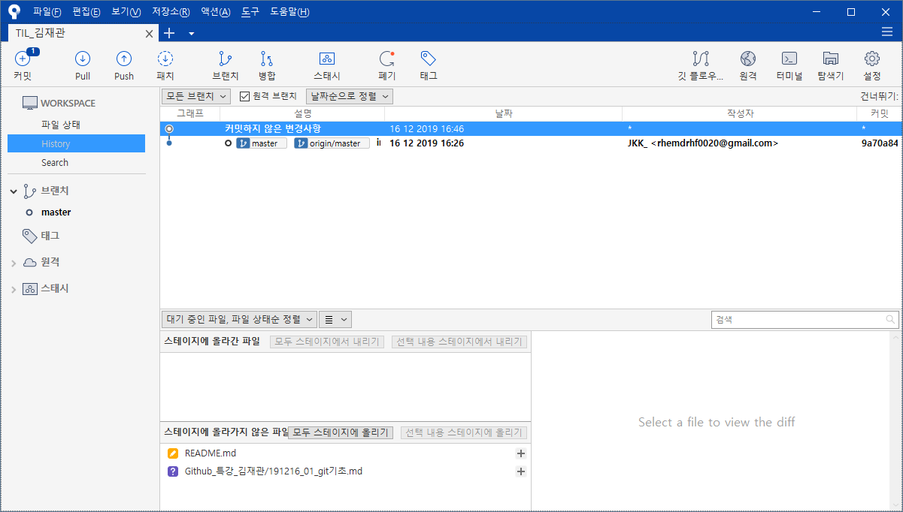
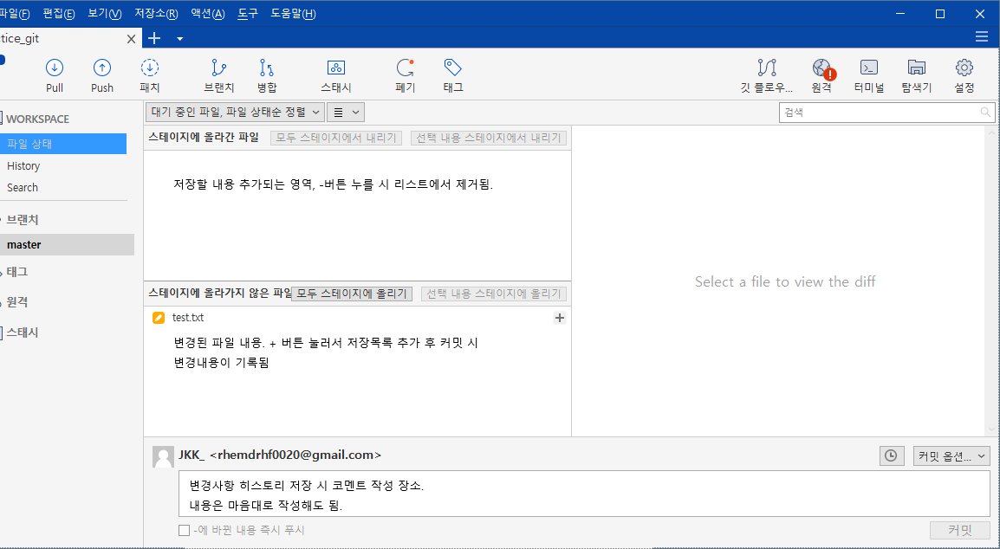
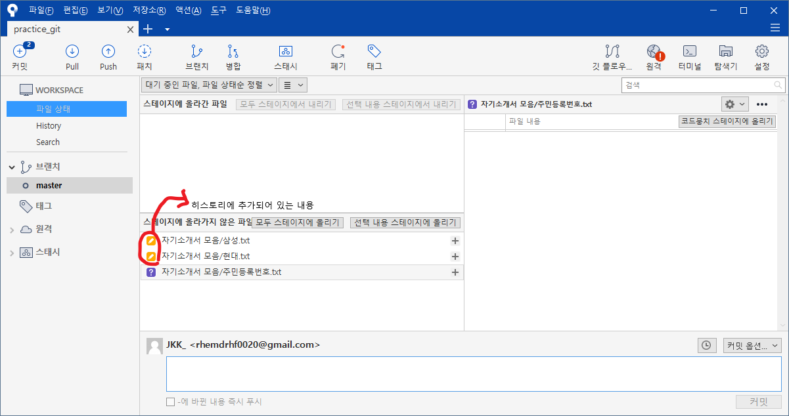
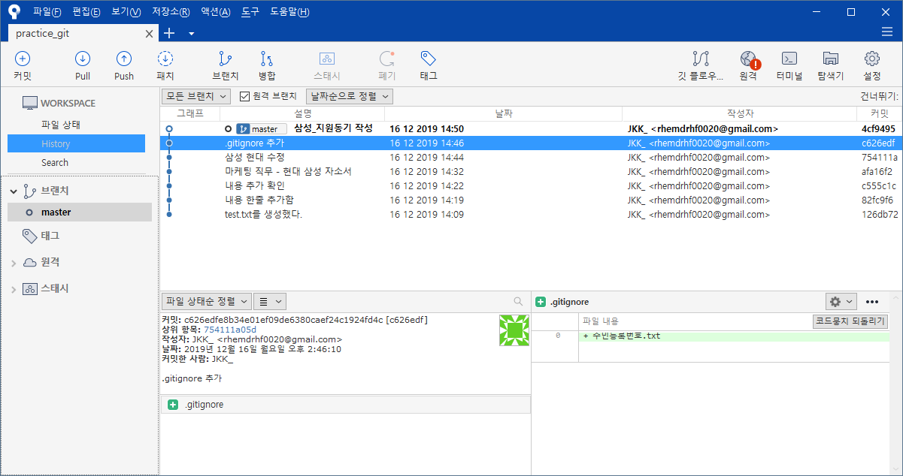
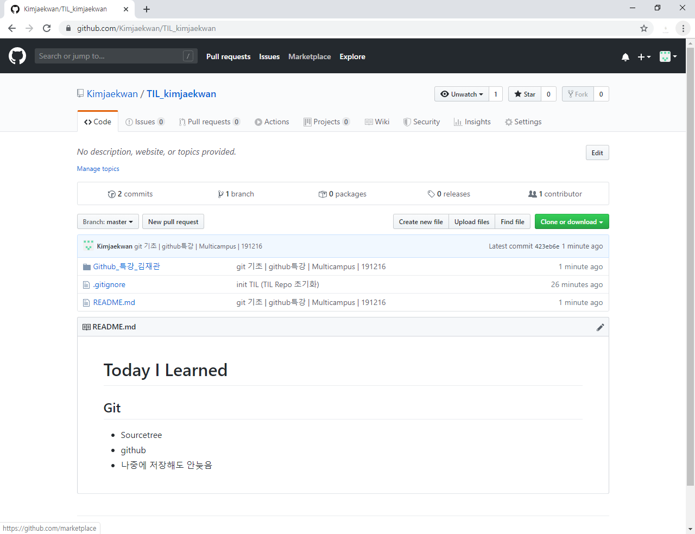

# Git 기초

## 개념

### SCM이란?

Source Code Manager의 약자로, 코드의 버전을 관리하기 위해 존재한다.

### Git

git은 리눅스 개발자가 만든 SCM으로 현재 가장 많이 사용된다.

### Github

github는 git이 관리하는 Repo의 원격 저장소를 제공하는 서비스.

가장 많이 사용하며, 오픈소스 프로젝트들이 성장하는 곳이다.

최근 MS에게 인수되었다.

### 사용 프로그램

- **Git**
- **SourceTree**
- **MS Visual Code**
- **Typora Editor**

## SourceTree

- git을 설치한 디렉토리에 대한 히스토리 관리 (관리하는 파일, 대상에서 변경점만 확인해 기록함.)

- Sourcetree에 파일은 노출되지만. 폴더는 노출되지 않음.

- 폴더 내에 파일 추가 시에는 노출됨.(폴더명/파일명 형식으로 노출됨)

- 커밋 코멘트는 자유롭게 적어도 되지만, 알아보기 편하도록 통일성 있게 작성하는 것이 중요함.

- 노란색 아이콘 > 등록된 파일, 보라색 아이콘. 아직 확인되지 않은 파일(미등록)

- 커밋을 통해 관리가 시작된 파일의 히스토리가 정리된 화면. 날짜와 파일에 대한 설명 등이 기록되어 있음.

- **※ 제외파일 설정**

  \1. git 설치한 메인 디렉토리 > Open with Code

  \2. 파일 리스트 > new File(Filename : .gitignore > 제외파일 디렉토리 설정하는 명칭)

  \3. .gitignore에 제외할 파일 이름을 기록 > 저장(제외 파일명을 지속적으로 리스트에 추가함.)

  \4. Sourcetree로 돌아와서 파일 업데이트 내용을 확인.

  ## Github

  

  **[SourceTree > Github Backup]**

  1. Github에 Remote 리포 생성

  2. 내 컴퓨터의 로컬 디렉토리를 선택후 Github에 연결

  3. Push로 Github로 전송

  4. Github에서 업로드 내용 확인(.gitignore 리스트에 추가된 파일은 보내지지 않음)
   ※ (Push는 신중하게 진행해야함. 되돌리기 힘들기 때문에 백업 전 확인이 필요함.)
  
**※ 백업 후에는 삭제를 해도 히스토리가 남기 때문에 최초 디렉토리 생성시 .gitignore를 만들어 노출되지 않을 항목을 추가하고 작업을 진행해야함.**

### 금일 진행 내용 정리

**1. 프로그램 설치(Git, Visualcode, SourceTree)**

**2. SourceTree를 통해 디렉토리에 Git 연결, .gitignore(번외폴더 생성)**

**3. 디렉토리에 컨텐츠 등록 > SourceCode에서 관리 시작**

**4. Git이 적용된 디렉토리를 Github와 연결**

**5. Push를 통해 관리중인 자료를 Github에 Backup**

**6. Typora Editor 설치 후 사용.**