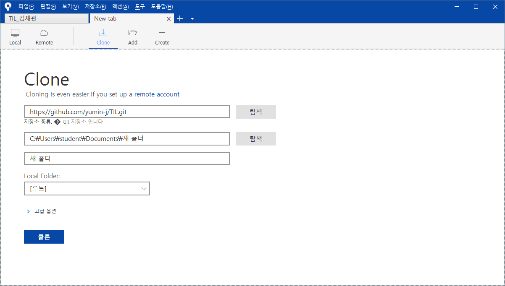
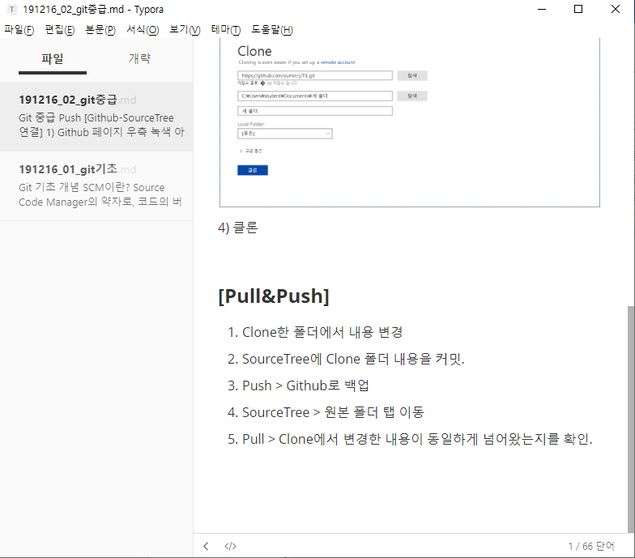
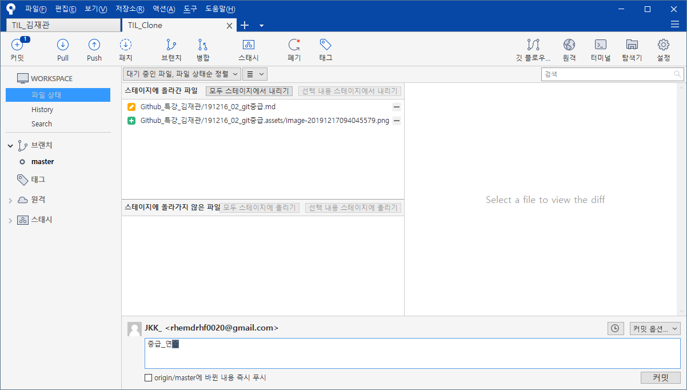
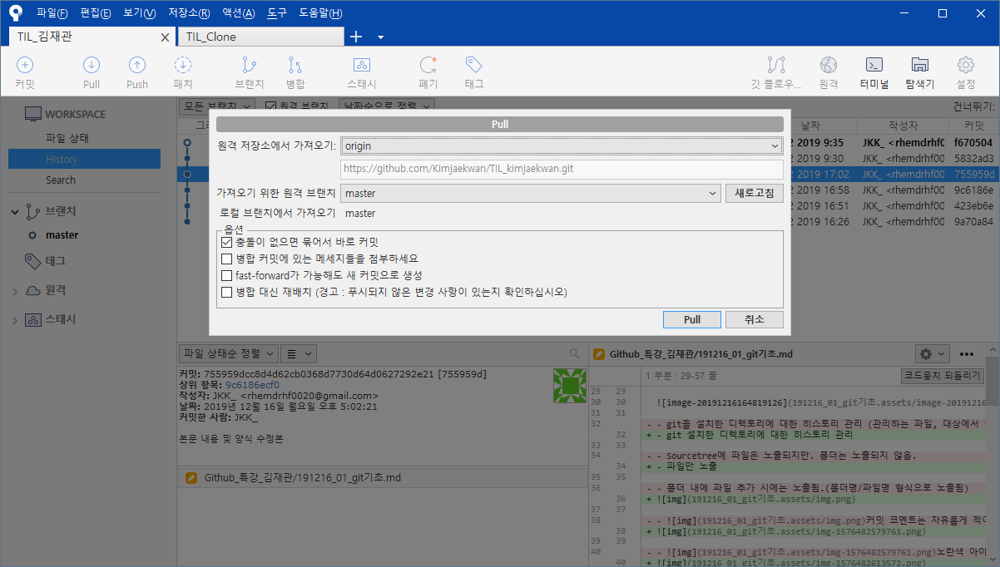

# Git 중급

## Push

**[Github-SourceTree 연결]**

1) Github 페이지 우측 녹색 아이콘 > 링크 복사

2) SourceTree > 새 탭 > Clone

3) Github에서 복사한 링크를 소스 경로에 입력 > 목적지 경로에 복제할 폴더명 입력

4) 클론

### **[Pull&Push]**

1. Clone한 폴더에서 내용 변경 > 저장
   
2. SourceTree에 Clone 폴더 내용을 커밋.
   
3. Push > Github로 백업
   
4. SourceTree > 원본 폴더 탭 이동
   
5. Pull > 원본 폴더에서 변경한 내용이 동일하게 넘어왔는지를 확인.

