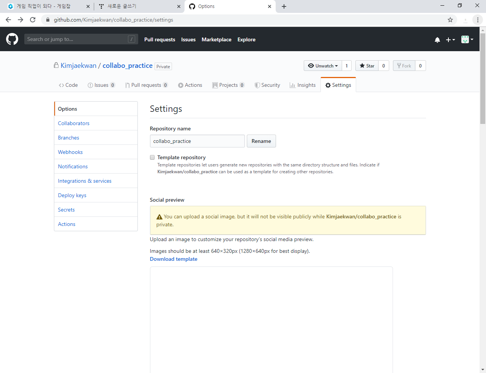
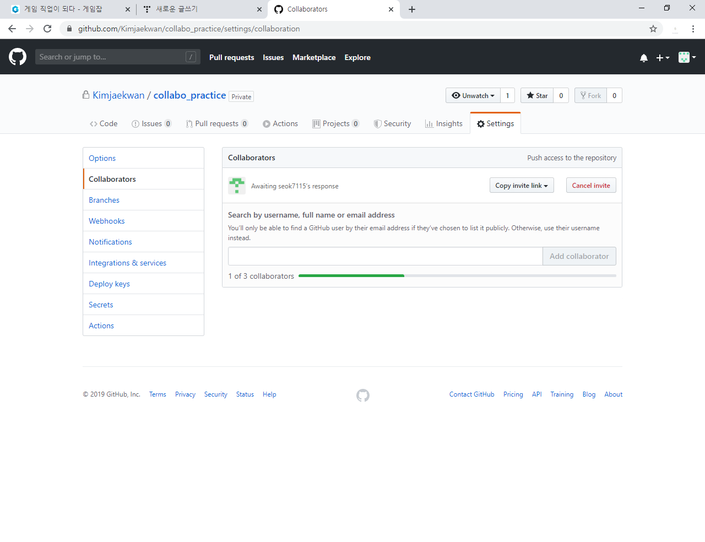
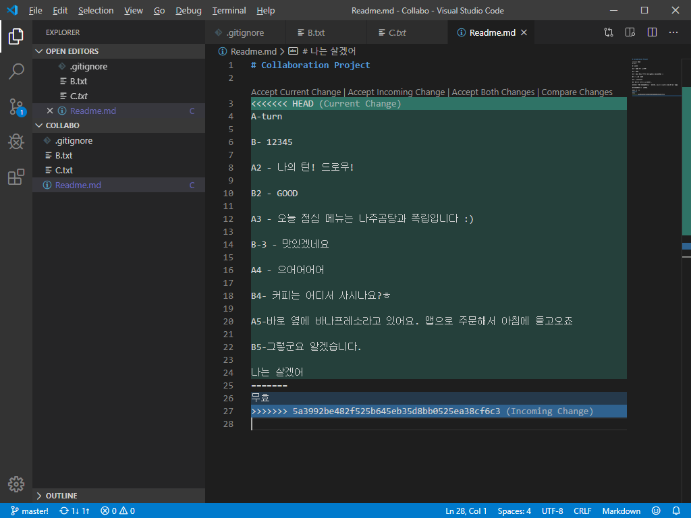
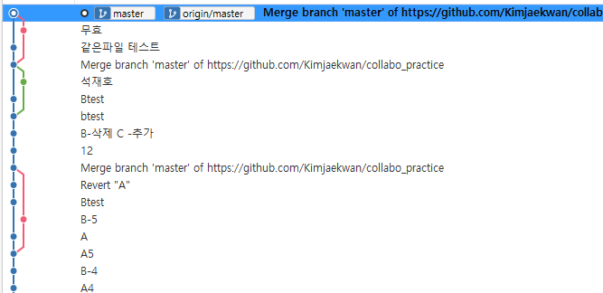

# Git 중급

## Clone

**[Github-SourceTree 연결]**

1) Github 페이지 우측 녹색 아이콘 > 링크 복사

2) SourceTree > 새 탭 > Clone

3) Github에서 복사한 링크를 소스 경로에 입력 > 목적지 경로에 복제할 폴더명 입력

4) 클론

### **[Pull&Push]**

1. Clone한 폴더에서 내용 변경 > 저장
   
2. SourceTree에 Clone 폴더 내용을 커밋.
   
3. Push > Github로 백업
   
4. SourceTree > 원본 폴더 탭 이동
   
5. Pull > 원본 폴더에서 변경한 내용이 동일하게 넘어왔는지를 확인.

## [Collaboration]

(기존 폴더 생성 > Git 설치 > SourceTree 연결 > Github 연결까지 완료)

1. Github > Settings
   
2. Collaborators > Passward 입력
3. 추가할 사용자 아이디 입력 > Invite
   
4. 추가된 사용자 > 새 탭 선택 > Clone(Clone 스텝과 동일하게 진행)
5. Clone 완료 후, Github와 Push&Pull을 이용하여 A, B 두 사용자가 번갈아가며 동일한 프로젝트의 진행 및 수정이 가능함.

※ 동일 github에서 동시에 파일 업로드 시에는 먼저 Push를 실행한 사람이 전송됨.

※  나중에 업로드하는 사람의 경우 Pull이 완료된 후에 Push가 가능함(상대가 Push할 시 무조건 Pull을 완료한 후에 Push 가능.)

## 충돌 상황 예시

### 1) 다른 파일 내용 충돌.(자동수정 가능)

- Pull이 완료된 이후 Push 실행 가능

### 2) 같은 파일 내용 충돌.(자동수정 안됨, 수동으로 수정해야됨.)

- 동일 파일 순차적 Push 시 에러 메시지 노출

- Pull 시 병합 완료 후 재 시도하라는 메시지 노출.

- VS로 이동시 삭제할 내용 선택 가능

  1) A, B 동시 작성.B가 내용 수정 후 먼저 업로드 > A가 수신 > 충돌.2) 남기는 내용 사항 선택 후 저장 > Cummit > Push
      - (동일내용 충돌 시, 결정권자의 선택에 따라 내용이 달라짐)
  3) A가 최종결정 후 B가 Pull 시, A가 결정한 내용이 남음.

## Master?

- 계속 커밋을 찍어나가는 이미지 > 나무

- 가지를 뻗어나가는 과정 > 브렌치 (복제-확장의 개념, 평행세계)

  

- Master > 나무의 근본. 맨 밑바탕(원본)

- Master의 입장에서 커밋은 최초 1회, 그 이후로는 합쳐짐(머지)라는 개념만 있어야 함.