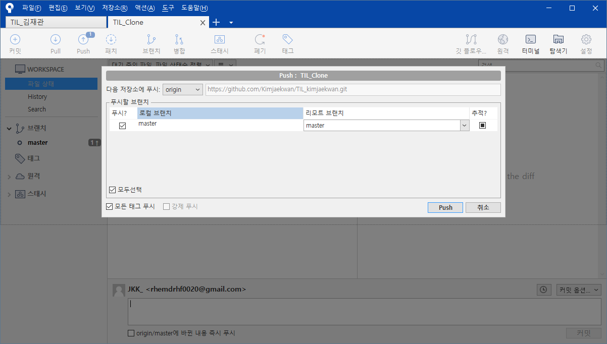

# Git 중급

## Clone

**[Github-SourceTree 연결]**

1) Github 페이지 우측 녹색 아이콘 > 링크 복사

2) SourceTree > 새 탭 > Clone

3) Github에서 복사한 링크를 소스 경로에 입력 > 목적지 경로에 복제할 폴더명 입력

4) 클론

### **[Pull&Push]**

1. Clone한 폴더에서 내용 변경 > 저장
   
2. SourceTree에 Clone 폴더 내용을 커밋.
   
3. Push > Github로 백업
   
4. SourceTree > 원본 폴더 탭 이동
   
5. Pull > 원본 폴더에서 변경한 내용이 동일하게 넘어왔는지를 확인.

## [Collaboration]

(기존 폴더 생성 > Git 설치 > SourceTree 연결 > Github 연결까지 완료)

1. Github > Settings
   
2. Collaborators > Passward 입력
3. 추가할 사용자 아이디 입력 > Invite
   
4. 추가된 사용자 > 새 탭 선택 > Clone(Clone 스텝과 동일하게 진행)
5. Clone 완료 후, Github와 Push&Pull을 이용하여 A, B 두 사용자가 번갈아가며 동일한 프로젝트의 진행 및 수정이 가능함.

※ 동일 github에서 동시에 파일 업로드 시에는 먼저 Push를 실행한 사람이 전송됨.

※  나중에 업로드하는 사람의 경우 Pull이 완료된 후에 Push가 가능함(상대가 Push할 시 무조건 Pull을 완료한 후에 Push 가능.)

## 충돌 상황 예시

### 1) 다른 파일 내용 충돌.(자동수정 가능)

- Pull이 완료된 이후 Push 실행 가능

### 2) 같은 파일 내용 충돌.(자동수정 안됨, 수동으로 수정해야됨.)

- 동일 파일 순차적 Push 시 에러 메시지 노출

- Pull 시 병합 완료 후 재 시도하라는 메시지 노출.

- VS로 이동시 삭제할 내용 선택 가능

  1) A, B 동시 작성.B가 내용 수정 후 먼저 업로드 > A가 수신 > 충돌.2) 남기는 내용 사항 선택 후 저장 > Cummit > Push
      - (동일내용 충돌 시, 결정권자의 선택에 따라 내용이 달라짐)
  3) A가 최종결정 후 B가 Pull 시, A가 결정한 내용이 남음.

## Master?

- 계속 커밋을 찍어나가는 이미지 > 나무

- 가지를 뻗어나가는 과정 > 브렌치 (복제-확장의 개념, 평행세계)

  

- Master > 나무의 근본. 맨 밑바탕(원본)

- Master의 입장에서 커밋은 최초 1회, 그 이후로는 합쳐짐(머지)라는 개념만 있어야 함.

**[Brenching]**

\- 평행세계. 

\- 원본 데이터를 지키기 위해 동일한 사본을 만들어 테스트를 진행하고, 목표치 달성 시 마스터로 병합하는 식으로 사용.

\- 작업중인 브렌치가 회생 불가능할 정도로 답이 없다면 삭제 역시 가능.

브렌치 화면, 브렌치 삭제 화면.

**[브렌치 변경/삭제점 되돌리기(복구사항)]**
1) 되돌리고자 하는 지점 선택 > 체크아웃 (이후 진행과정의 완전 초기화.)

2) 되돌리고자 하는 지점 선택 > 이 커밋까지 현재 브렌치를 초기화(내부 코드를 남길 수 있음.)

hard : 완전 초기화.
mixed : stage 올라가기 전으로
soft 스테이지 올라간 다음으로 변경

(로컬 컴퓨터에서의 되돌리기, 리셋 과정은 문제가 없지만, github를 통해 협업하는 과정에서는 위험성이 높기 때문에 주의가 필요함.)

**[브렌치 충돌 상황]**

1) 다른 파일로 인한 충돌 : 오토 머지가 진행됨

2) 같은 파일로 인한 충돌 : 오토 머지가 완료되지 않으며, 사용자 본인이 수정해야 함.

(충돌이 발생한 경우, 보라색으로 충돌이 난 폴더와 파일을 표기함)

**[금일 진행 내용 간단 정리]**

**[금일 진행 내용 간단 정리]**

1. Github에 저장된 Repo 내용을 셋팅되어있지 않은 PC 혹은 디렉토리에 적용(Clone, Pull&Push)

2. Github를 통해 다른 사용자를 초대해 공동 프로젝트 제작 방법&기초 진행(Collaboration)

3. 기초적인 충돌 상황 예시 및 리셋 방법(동일/개별 파일 충돌, Push 충돌 등)

4. Brench(프로젝트를 나무로 구분한다면 가지 부분. 메인에서 확장된 평행세계 개념)

\-  커밋, 머지, 푸쉬 등을 진행할 시에는 항상 주의해야 함.

\-  Master Brench는 곧바로 소비자에게 판매될 수 있을 정도의 제품이어야 하기에 변경 및 수정에는 굉장히 신중해야 함.

\- 일반적인 변경 작업의 경우 Brench를 통해 작업을 완료하고 최종적으로 Master에 Merge하는 방식으로 진행됨.

\- 각 회사마다 Brench, Merge 양식 및 기준이 다름. 실제 업무에 진입하면서 배우는 것이 빠를 수 있으니 금일 교육에 대해서는 맹신이 아닌 방식의 이해 및 업무 시 참고 등으로 생각해야 함.