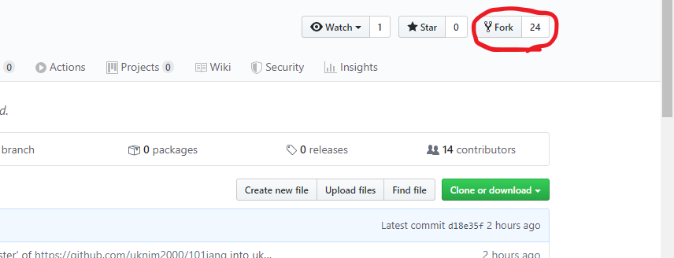
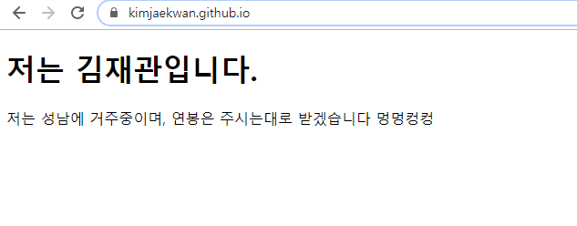
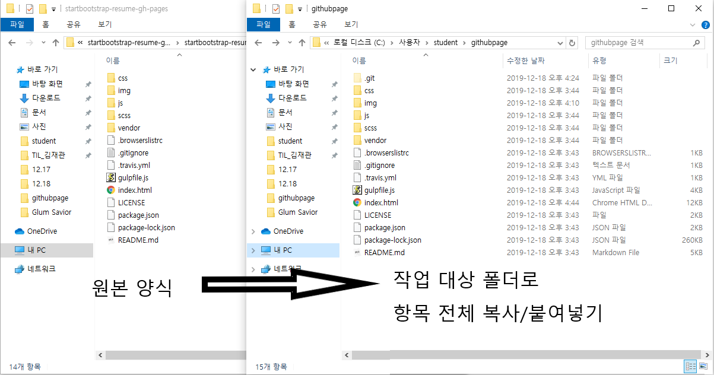
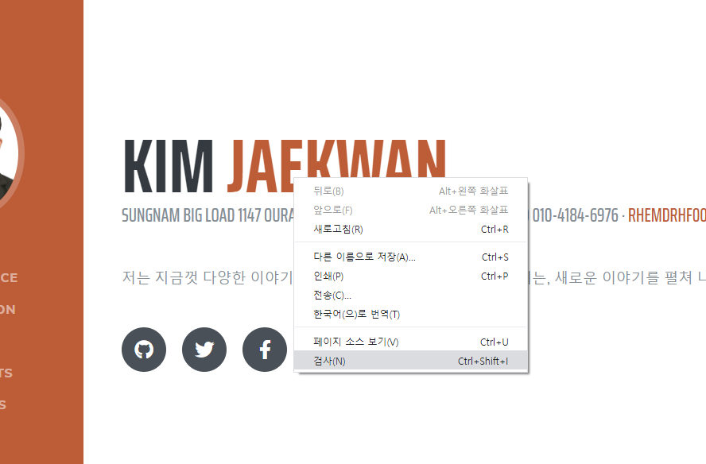
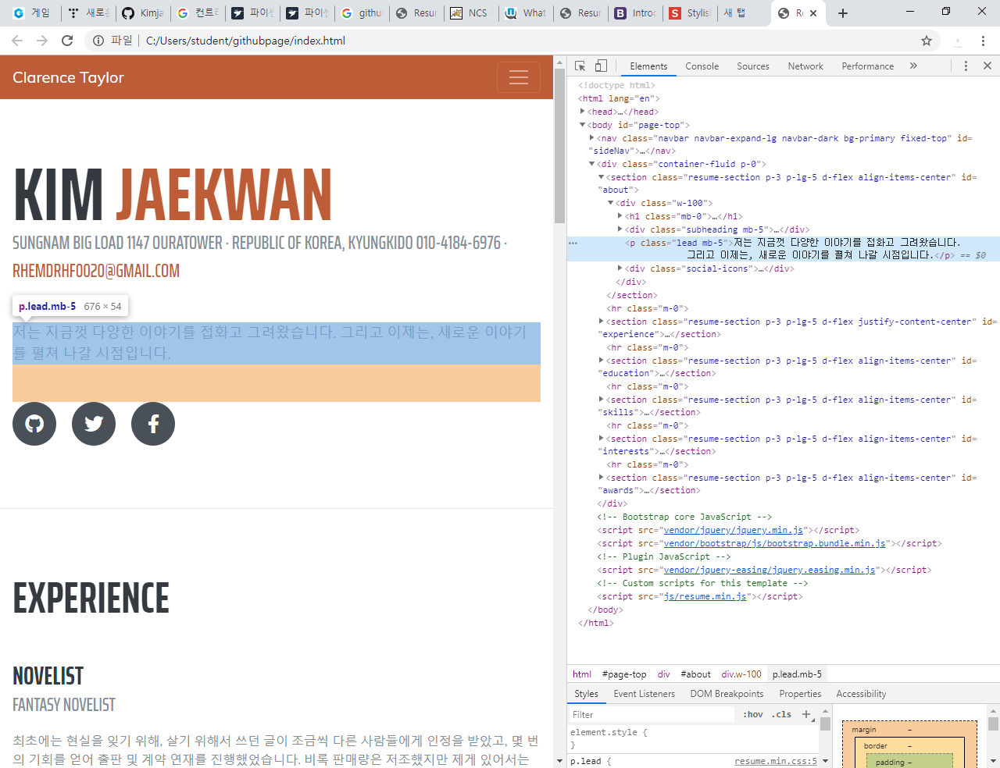

# Collaboration&Html

## Collaboration

[Full Request]**

**- 협업의 개념을 넘어서, 자신과 연관이 없는 사람들에게 기획 등을 제안하는 것.**

**Fork : 다른 사람의 Repo를 자신의 것으로 복사해 오는 행위**

**1) Fork를 통해 개인 디렉토리에 프로젝트 복사(clone)**

**2) 프로젝트 수정이나 변경 후 커밋 > 푸쉬**

**3) Github접속 후 fullrequest(원본자에게 전달)**

## HTML

**[웹 코딩]**

\1. 난이도가 상대적으로 낮음

\2. 노력대비 아웃풋이 높음.

\3. 접근성이 좋음.

\4. 오픈소스를 통한 작업이 용이함.

**[Github와 Html을 이용해 간단한 웹 페이지 만들기]**

\1. Github Repo 생성(Repo name : https://kimjaekwan.github.io/)

\2. SourceTree 적용(기존 방법과 동일)

\3. html 파일 생성

\4. SourceTree를 통해 html파일을 Github Repo로 Push

\5. Push 완료 후 Github Repo 접속 > github 이름으로 설정한 Kimjaekwan.github.io 주소로 접속 확인

\6. html로 작성된 파일 내용을 웹 주소에서 접속이 가능한 것을 확인.

웹 주소 : https://kimjaekwan.github.io/

HTML : 웹페이지의 골격이 되는 정보를 전달하는 역할

CSS : 웹 페이지의 디자인을 담당하는 역할.
\- CSS Diner(https://flukeout.github.io/) : CSS 선택자를 공부하는 사이트.

JAVAscript : 웹 페이지의 동작을 나타냄(사용자와 상호작용을 할 수 있도록 보조함.)

\- html 내에서 script를 입력하면 JAVA script를 사용할 수 있음.
**[Bootstrap]**(https://getbootstrap.com/) : Html, CSS, JAVAscript 양식 및 명령어를 기록해 놓은 사이트

**[Start Bootstrap Portfolio]**(https://startbootstrap.com/themes/portfolio-resume/) : Html을 이용한 각종 무료 양식의 다운로드가 가능함.

**[사용법]**

1) 양식 다운로드

2) 다운로드 받은 양식을 압축 해제

3) 압축 해제한 폴더의 내용을 복사 후, 자신이 수정하고자 하는 HTML 기록이 저장된 폴더로 복사/붙여넣기

4) 덮어쓰기 완료 후 html 더블클릭 시 변경된 양식이 적용됨

**[수정법]**

1) html 아이콘 더블클릭으로 해당 페이지 접속

2) 우클릭 > 검사 선택 후 수정하고자 하는 지점에 어떤 코드가 적용되어 있는지 확인

3) 양식이 저장된 폴더로 이동 > 우클릭 > Open with code

4) Visual studio code에서 수정할 코드를 검색 후 내용 변경 후 저장

Visual studio code에서 해당 코드를 수정 후 저장

5) HTML 페이지 재 접속 후 새로고침

\- 웹에 업로드를 완료한 페이지의 경우 SourceTree를 이용해 Cummit, Push. 후 재 접속하여 새로고침 시 변경 양식이 적용됨